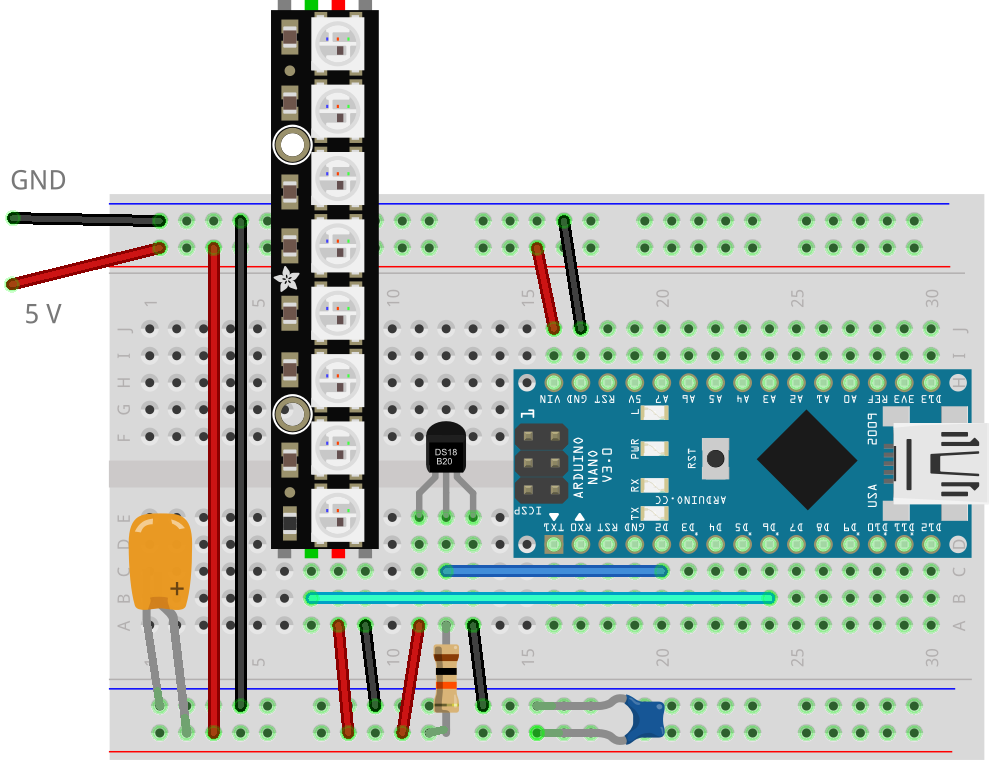

FREIA Thermometer {#freia-thermometer align="center"}
=================

### V. Ziemann, Uppsala University, Uppsala, Sweden {#v.-ziemann-uppsala-university-uppsala-sweden align="center"}

### Jan 26, 2024 {#jan-26-2024 align="center"}

In order to present the current outdoors temperature in an attractive
way in our lab called FREIA, I use a fairly robust DS18b20 thermometer
that has the sensor encapsulated in a waterproof sensor-head with a
robust cable attached. An Arduino NANO reads out the thermometer and
displays the temperature with the help of a NeoPixel strip with sixty
three-color LED. The design is loosely based on the NeoPixel Thermometer
discussed in Section 4.5.7 in my book *A Hands-on Course in Sensors
using the Arduino and Raspberry Pi, 2nd edition* that was published by
CRC Press in 2023 where more information on this and other projects can
be found. See also the book\'s code repository at
[`https://github.com/volkziem/HandsOnSensors2ed`](https://github.com/volkziem/HandsOnSensors2ed).

::: {.p}
:::

::: {.p}
:::

[]{#tth_fIg1}

::: {style="text-align:center"}

:::

::: {style="text-align:center"}
Figure 1: []{#fig:bb} FREIA Thermometer.
:::

::: {.p}
:::

I assembled a prototype system on the solder-less breadboard shown
below. The NANO is mounted on the right-hand side of the breadboard. It
receives electrical power via the upper power rails. All ground
connections use black wires and all 5 V connections use red wires. Power
is provided by an external 5 V supply attached to the top left of the
breadboard. Note that large Neopixel arrays may require up to 60 mA per
pixel if all pixels are illuminated fully. So make sure that the power
supply provides enough power. Immediately to the left of the NANO, the
DS18b20 is mounted and connected to the lower power rails. Its data pin
is connected with a 10 kΩ pullup resistor to 5 V and with a blue wire to
pin D2 on the NANO to read out the temperature values. Note that the
pullup may already be included on DS18b20, especially if it comes on a
small breadboard. To the left of the DS18b20 the Neopixel strip is
shown. It is also connected to the power rails and its DataIn pin is
connected via the cyan-colored wire to pin D6 on the NANO. I also added
two capacitors with a few μF and 100 nF across the lower power rails to
stabilize the voltage.

::: {.p}
:::

The code that brings the project to live is reproduced below. First we
include support for 1-wire protocol and the specifics of the DS18b20
sensor before specifying with which pin to readout the temperature. The
next two lines instantiate the oneWire connections and tell the NANO
that there is a DS18b20 connected to it. We communicate with the sensor
via the object `sensors.` Then we include support for the Neopixels,
define how many pixels are on our strip and to which pin it is
connected, and instantiate the object `pixels` that we henceforth use to
control the Neopixels.

::: {.p}
:::

In the function `setup()` we open the serial connection, which useful
for debugging. Comment out this line in the final version. Next, the tow
call to `sensors` and `pixels` initialize the systems and allow us to
communicate with the DS18b20 and the Neopixel in the main program that
is defined in the function `loop()` that is repeatedly executed. In
every iteration, we first read out the DS18b20, store the value in the
variable `temp`, and convert it to the integer `itemp.` For debugging
purposes, I then write the values to the serial port. Comment out this
line in the production version. Before displaying the new temperature on
the Neopixels, we clear all pixels. The loop over the variable `k`
causes a slight flicker of the Neopixels, which I found a bit more
pleasant to look than constant intensities. The following loop over the
variable `i` sets he pixels, one at a time. Here we use the convention
that the first 20 Neopixel display sub-zero temperatures, the next 20
pixels show temperatures between zero and 20 C in green, and all higher
temperatures are displayed in red. Thus 24 C is shown by 20 blue, 20
green, and 4 red Neopixel. The code implements just this convention. The
calls to `random()` inside the function `pixels.setPixelColor()` causes
the flickering. After the loop over `i` all pixels are updated at once
with `pixel.show()`. After a 50 ms delay, the next iteration over `k`
starts.

::: {.p}
:::

In a nutshell, the system reads the temperature, loops of 20 flickering
iterations and updates the displayed temperature before starting with
the next reading of temperatures. And that\'s all. Have fun!

      //FREIA thermometer, V. Ziemann, 221020
      // DS18b20 1-wire temperature sensor
      #include <OneWire.h>
      #include <DallasTemperature.h>
      #define ONE_WIRE_BUS 2  // pin 2
      OneWire oneWire(ONE_WIRE_BUS);
      DallasTemperature sensors(&oneWire);
      #include <Adafruit_NeoPixel.h> 
      #define NUMPIXELS 60
      #define PIN 6 
      Adafruit_NeoPixel pixels(NUMPIXELS, PIN, NEO_GRB + NEO_KHZ800);
      void setup() {
        Serial.begin(115200); delay(2000);
        sensors.begin();
        pixels.begin();  
      }
      void loop() {
        sensors.requestTemperatures();
        float temp=sensors.getTempCByIndex(0);
        int itemp=(int)temp;
        Serial.print(temp); Serial.print('\t'); Serial.println(itemp);
        pixels.clear();
        for (int k=0;k<20;k++) {  // incandescent mode
          for (int i=0;i<itemp+20;i++) {
            if (i<20) {        // less than zero -> blueish
              pixels.setPixelColor(i,pixels.Color(random(20),random(20),100+random(30)));
            } else if (i<40) { // from 0 to 19 C -> greenish  
              pixels.setPixelColor(i,pixels.Color(random(20),100+random(30),random(20)));
            } else {           // 20 C and above -> reddish
              pixels.setPixelColor(i,pixels.Color(130+random(30),random(20),random(20)));
            }   
        //  pixels.setPixelColor(i,pixels.Color(20+10*i+random(30),20,100-10*i+random(30)));
          }
          pixels.show();   
          delay(50);
        }
      }

\
\

------------------------------------------------------------------------

[File translated from T~[E]{.small}~X by
[T~[T]{.small}~H](http://hutchinson.belmont.ma.us/tth/), version 4.08.\
On 26 Jan 2024, 14:41.]{.small}

